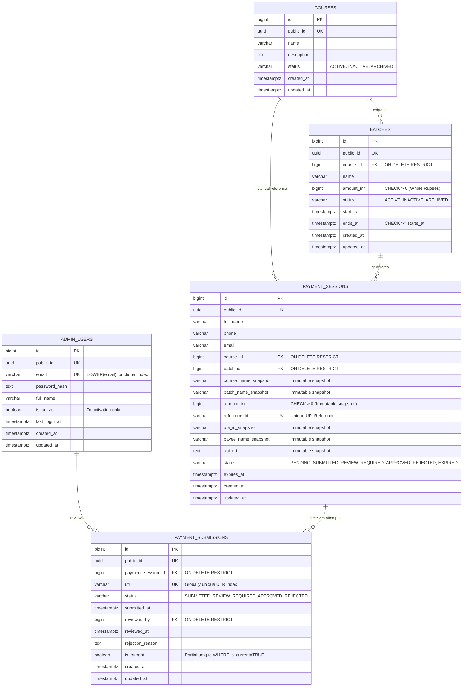

# Database Architecture & Schema Specification — Phase 2

Comprehensive technical documentation for the **Samagra UPI Automation** PostgreSQL 16 database foundation.

---

## 1. Entity-Relationship Architecture



---

## 2. Core Architectural Decisions

### 2.1 Whole-Rupee Monetary Representation (`BIGINT amount_inr`)
- Course fees and payment amounts are strictly represented in **whole Indian Rupees (INR)**:
  - Example: `₹2000` is stored directly as `2000`.
- **Prohibitions**:
  - No `amount_paise` columns.
  - No `FLOAT`, `DOUBLE PRECISION`, or arbitrary decimal types.
- **Invariant**: All monetary columns enforce `CHECK (amount_inr > 0)`.

### 2.2 Primary Key & Identifier Strategy
- **Internal Relational IDs**: `id BIGINT GENERATED ALWAYS AS IDENTITY PRIMARY KEY` on every table for compact joins and optimal B-tree index performance. Internal IDs are never exposed in public endpoints.
- **External Public IDs**: `public_id UUID NOT NULL UNIQUE` generated via Python `uuid.uuid4()`. All public/API interactions reference `public_id`.

### 2.3 Historical Snapshot Strategy
To maintain absolute historical financial auditability:
- When a `payment_sessions` record is generated, it copies immutable snapshots:
  - `course_name_snapshot`
  - `batch_name_snapshot`
  - `amount_inr`
  - `upi_id_snapshot`
  - `payee_name_snapshot`
  - `upi_uri`
- Future updates to course titles, cohort names, batch prices, or institutional UPI IDs will **never** alter historical payment session records.

### 2.4 Timestamp Strategy & `updated_at` Contract
- All timestamps use `TIMESTAMPTZ` (UTC).
- `created_at`: Database-defaulted with `server_default=func.now()`.
- `updated_at`: Database-initialized with `server_default=func.now()` and consistently maintained at the application layer by SQLAlchemy via `onupdate=func.now()`.
- Python code strictly uses timezone-aware datetimes (`datetime.timezone.utc`).

### 2.5 Admin Account Deletion Invariant
- Admin accounts are **deactivated (`is_active = FALSE`)**, never physically deleted.
- The `ON DELETE RESTRICT` constraint on `payment_submissions.reviewed_by` ensures audit trail integrity.

---

## 3. Status Lifecycle & Invariants

```text
[ Participant Checkout ]
          │
          ▼
       PENDING ──(Initial UTR Submitted)──► SUBMITTED
                                               │
                                               ▼
                                        REVIEW_REQUIRED
                                         │            │
                           (Admin Approve)            (Admin Reject)
                                         │            │
                                         ▼            ▼
                                     APPROVED     REJECTED
                                                      │
                                           (Corrected UTR Submitted)
                                                      │
                                                      ▼
                                                  SUBMITTED
```

| Payment Session Status | Invariant Condition for Submissions | Next Allowed Transitions |
| :--- | :--- | :--- |
| **`PENDING`** | No `PaymentSubmission` exists for this session. | $\rightarrow$ `SUBMITTED`, `EXPIRED` |
| **`SUBMITTED`** | Current `PaymentSubmission` (`is_current = TRUE`) exists with status `SUBMITTED` or `REVIEW_REQUIRED`. | $\rightarrow$ `REVIEW_REQUIRED`, `APPROVED`, `REJECTED` |
| **`REVIEW_REQUIRED`** | Current `PaymentSubmission` has status `REVIEW_REQUIRED`. | $\rightarrow$ `APPROVED`, `REJECTED` |
| **`APPROVED`** | Current `PaymentSubmission` has status `APPROVED` (terminal). | *(Terminal)* |
| **`REJECTED`** | Current `PaymentSubmission` has status `REJECTED`. | $\rightarrow$ `SUBMITTED` (on corrected UTR submission) |
| **`EXPIRED`** | Session timed out before valid submission (terminal). | *(Terminal)* |

---

## 4. Concurrency & Locking Strategy

- **UTR Submission Locking**: When updating or inserting a new UTR submission for a payment session, `PaymentSubmissionService.submit_utr` acquires an explicit row-level lock on the target `PaymentSession` (`SELECT ... FOR UPDATE` via `with_for_update()`):
  1. Lock target `PaymentSession` row (`SELECT ... FOR UPDATE`).
  2. Validate legal status (`PENDING` or `REJECTED`).
  3. Mark existing submission for the session `is_current = FALSE`.
  4. Insert new submission with `is_current = TRUE` and status `SUBMITTED`.
  5. Update `PaymentSession.status = 'SUBMITTED'`.
  6. Commit transaction.
- **Approval / Rejection Locking**: When an admin reviews a payment submission, `PaymentSubmissionService.approve_submission` and `PaymentSubmissionService.reject_submission` acquire explicit row locks on both the target submission and its parent session:
  1. Lock target `PaymentSubmission` row (`SELECT ... FOR UPDATE`).
  2. Validate submission status (`SUBMITTED` or `REVIEW_REQUIRED`).
  3. Lock parent `PaymentSession` row (`SELECT ... FOR UPDATE`).
  4. Validate session status (`SUBMITTED` or `REVIEW_REQUIRED`).
  5. Atomically update submission status (`APPROVED` / `REJECTED`), reviewer metadata, and session status.
  6. Commit transaction.
- **Partial Unique Index Protection**: `CREATE UNIQUE INDEX ux_payment_submissions_current ON payment_submissions (payment_session_id) WHERE is_current = TRUE;` guarantees at the database engine level that no two concurrent processes can leave multiple active submissions.

---

## 5. Indexing Catalog

| Table | Index Name | Columns / Expression | Type / Purpose |
| :--- | :--- | :--- | :--- |
| `admin_users` | `ux_admin_users_email_lower` | `LOWER(email)` | Functional Unique Index |
| `courses` | `ix_courses_status` | `status` | Status Filtering |
| `batches` | `ix_batches_course_id` | `course_id` | Foreign Key Lookup |
| `batches` | `ix_batches_status` | `status` | Status Filtering |
| `batches` | `ix_batches_course_status` | `course_id, status` | Compound Query Support |
| `payment_sessions` | `ux_payment_sessions_reference_id`| `reference_id` | Unique Constraint Index |
| `payment_sessions` | `ix_payment_sessions_status` | `status` | Lifecycle Filtering |
| `payment_sessions` | `ix_payment_sessions_phone` | `phone` | Participant Lookup |
| `payment_sessions` | `ix_payment_sessions_created_at`| `created_at` | Time-series Ordering |
| `payment_sessions` | `ix_payment_sessions_batch_status`| `batch_id, status` | Cohort Payment Filtering |
| `payment_submissions`| `ux_payment_submissions_utr` | `utr` | Global UTR Unique Index |
| `payment_submissions`| `ux_payment_submissions_current` | `payment_session_id WHERE is_current = TRUE` | Partial Unique Index |
| `payment_submissions`| `ix_payment_submissions_payment_session`| `payment_session_id` | Foreign Key Lookup |
| `payment_submissions`| `ix_payment_submissions_status` | `status` | Lifecycle Filtering |
| `payment_submissions`| `ix_payment_submissions_submitted_at`| `submitted_at` | Audit Time Ordering |

---

## 6. Migration & Database Operations

### Run Migrations to Head
```bash
docker compose exec backend alembic upgrade head
```

### Rollback Migration
```bash
docker compose exec backend alembic downgrade base
```

### Inspect Database Schema
```bash
docker compose exec postgres psql -U app_user -d training_payments -c "\dt"
docker compose exec postgres psql -U app_user -d training_payments -c "\d+ payment_sessions"
docker compose exec postgres psql -U app_user -d training_payments -c "\d+ payment_submissions"
```

### Populate Development Seed Data
```bash
docker compose exec backend python scripts/seed_dev.py
```
